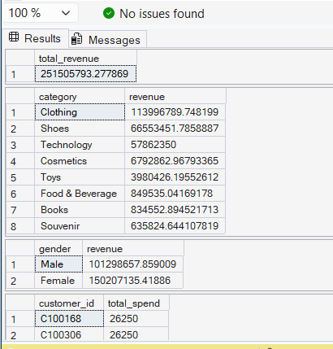
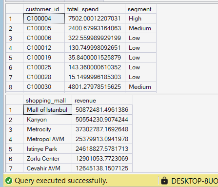
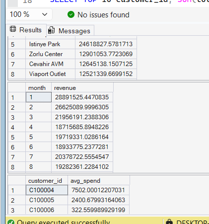
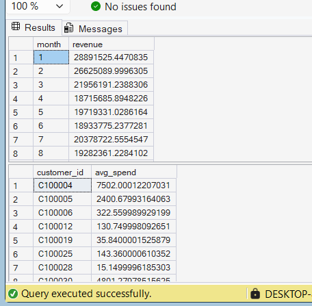
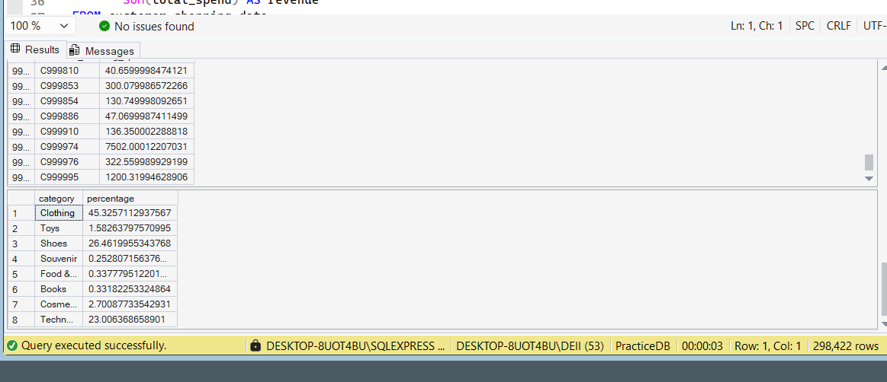

🛒 Customer Shopping Data Analysis
📌 Problem Statement

Analyze customer purchasing behavior to identify high-value customers, category performance, and sales trends.

📊 Tools Used

Excel, SQL Server

🔍 Steps Performed
Cleaned and structured dataset in Excel
Created new metrics like total spend, frequency, and segmentation
Built pivot tables and charts for analysis
Performed SQL queries for aggregation and insights
📈 Key Insights
Certain categories contribute majority of revenue
High-value customers generate significant revenue
Sales vary across locations and time
💡 Business Recommendations
Focus on high-value customers for retention
Promote high-performing categories
Optimize low-performing locations
📊 Dashboard Preview
## 📊 Dashboard Preview  

